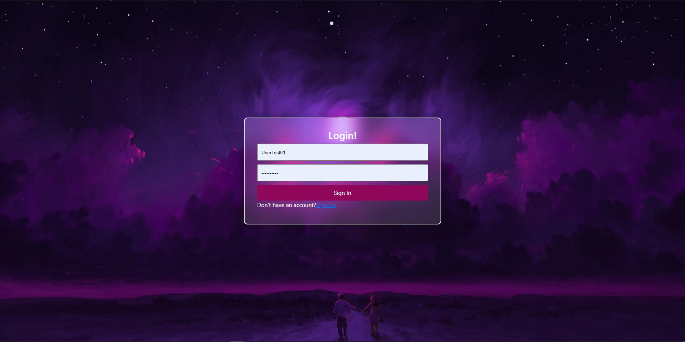
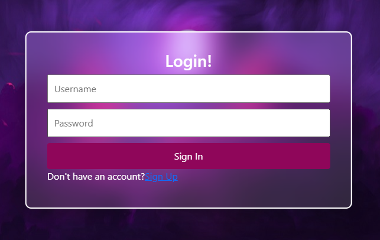
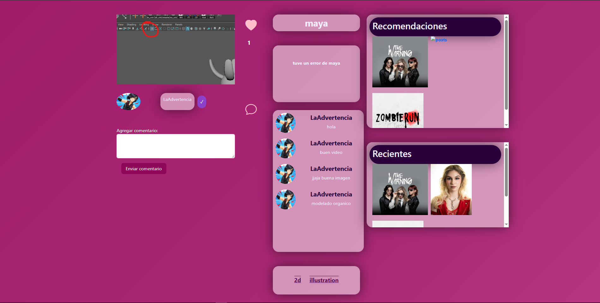

Aldo Rogelio Gonzàlez Zapata, Jose Armando Hernandez Santander

WEBART
WebArt es una aplicación dirigida a los artistas, donde pueden subir dibujos, modelos, render, etc. Podrán interactuar dándole likes, una comunidad de galería para admirar el arte de los artistas. 

Una plataforma en línea donde artistas pueden compartir, descubrir y publicar arte. Ofrece recomendaciones personalizadas, interacción con la comunidad y opciones de descubrir obras de arte.

.
.
.
.
.
.

Las carpetas de Fron y Back end estan separadas, y se tiene uan carpeta con los querys necesarios para la base de datos.

Galeria de Web Art

### Pantallas para el Resgistro/Login

## Pantallas Para el manejo de la publicaciones

