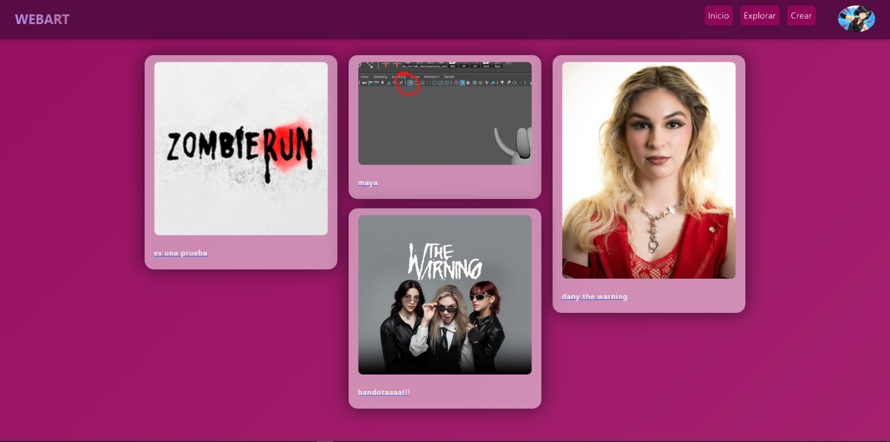
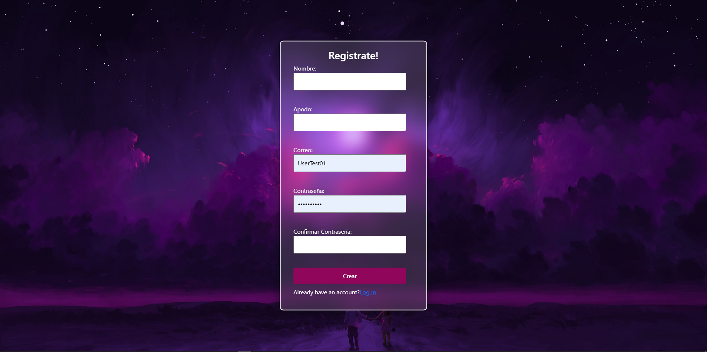
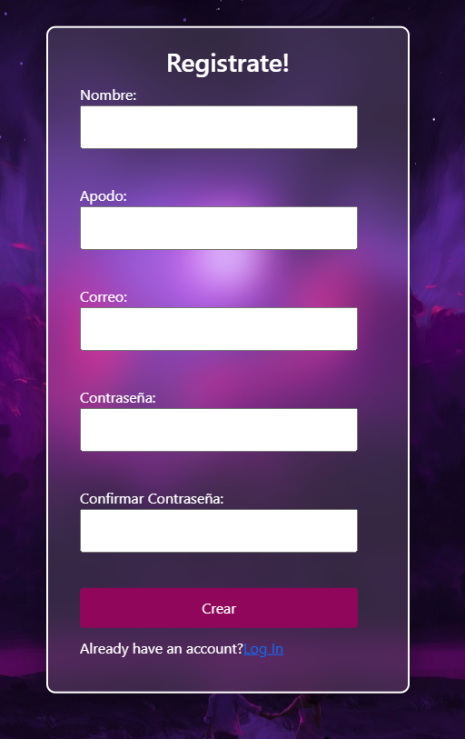
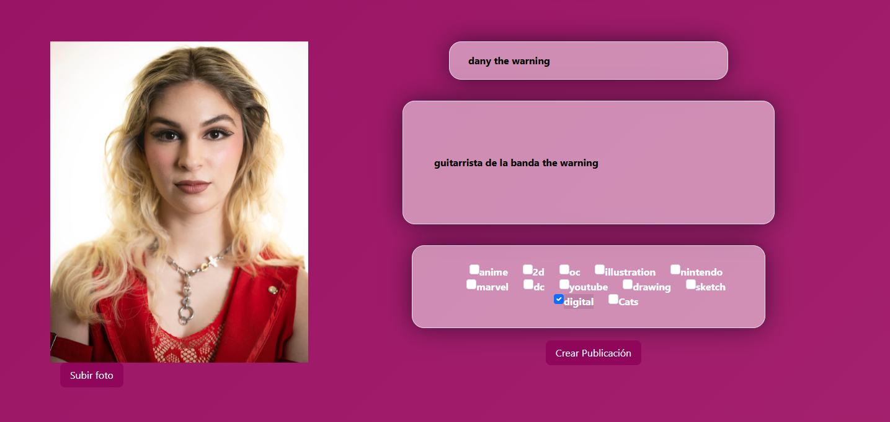
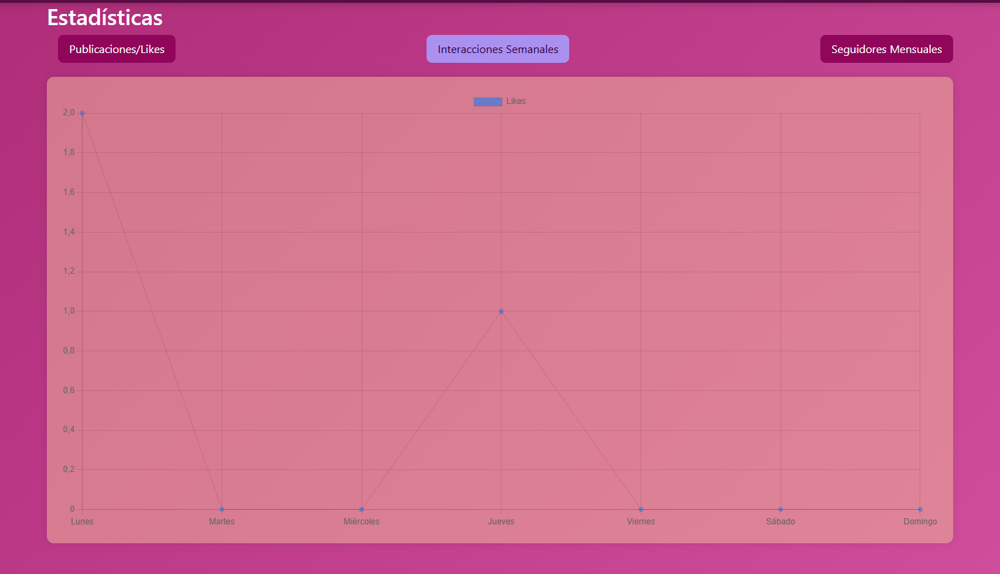
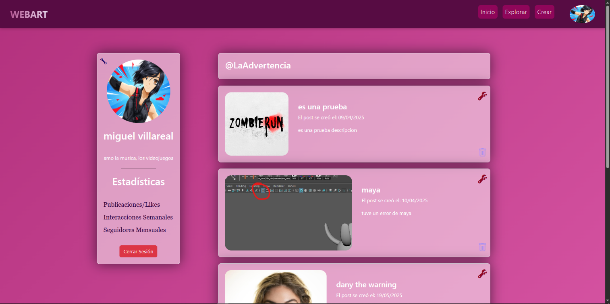
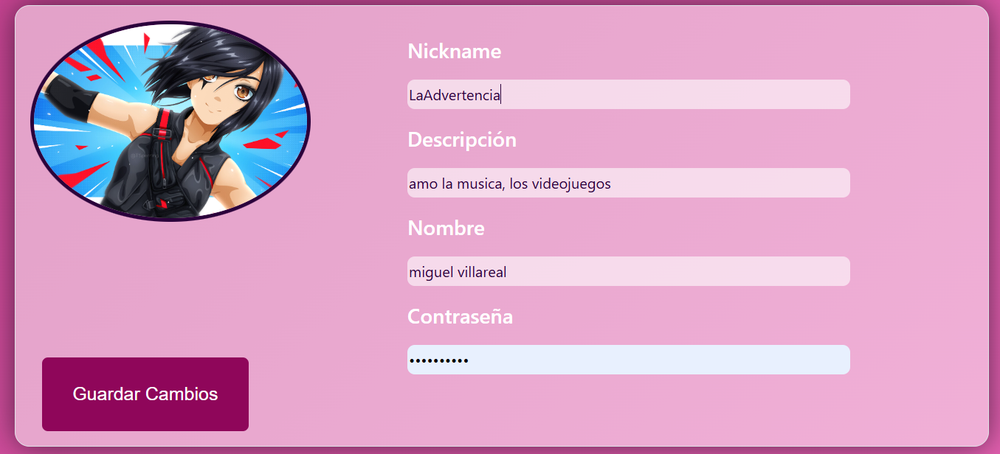

# 🎨 WebArt - Plataforma de Gestión y Difusión Artística

> **Proyecto Académico Full Stack | Licenciatura en Multimedia y Animación Digital (LMAD)**

**WebArt** es una aplicación web progresiva diseñada para democratizar la exposición de arte digital. Funciona como una red social vertical donde ilustradores y modeladores pueden gestionar portafolios, interactuar con una comunidad activa y obtener métricas sobre el alcance de su obra.

## 📋 Descripción del Proyecto

El propósito de WebArt es ofrecer un ecosistema digital donde artistas y profesionales puedan exhibir sus obras (renders, dibujos 2D, modelos 3D) y recibir retroalimentación cualitativa. A diferencia de galerías estáticas, WebArt fomenta la conexión mediante un sistema de **comunidad interactiva**.

### 🎯 Objetivos Técnicos
- Desarrollo de una arquitectura **SPA (Single Page Application)** desacoplada.
- Implementación de seguridad y privacidad en la gestión de activos digitales.
- Creación de una experiencia de usuario (UX) fluida para la exploración de contenido visual pesado.

## ✨ Características y Funcionalidades (Alcance)

Basado en el análisis de requerimientos del sistema:

### 👤 Gestión de Perfiles y Dashboard
- **Identidad Digital:** Personalización de perfil con avatar, biografía y gestión de credenciales.
- **Analítica de Usuario:** Visualización de métricas clave como:
  - 📈 Interacciones semanales.
  - 👥 Seguidores mensuales.
  - ❤️ Conteo global de Likes.

### 🖼️ Módulo de Publicaciones (Core)
- **Carga de Contenido:** Sistema de subida (Upload) optimizado para imágenes.
- **Categorización:** Clasificación de obras mediante etiquetas (2D, 3D, Concept Art) para facilitar el descubrimiento en el motor de búsqueda "Explorar".
- **Interacción Social:**
  - Sistema de **Comentarios** anidados.
  - Funcionalidad de **Seguir (Follow)** entre artistas.
  - **Likes** y guardado de favoritos.

### 🔍 Navegación y Descubrimiento
- **Feed Inteligente:** Sección de "Inicio" con algoritmos de recomendación (Recientes vs. Populares).
- **Buscador:** Filtrado avanzado por título, artista o categoría.

## 🛠️ Stack Tecnológico

| Capa | Tecnología | Descripción |
| :--- | :--- | :--- |
| **Frontend** | **React.js** | Biblioteca para la construcción de interfaces dinámicas y responsivas. |
| **Estilos** | **CSS3 / Modules** | Diseño visual personalizado y adaptativo. |
| **Backend** | **Node.js** | Entorno de ejecución para la lógica del servidor y API REST. |
| **Base de Datos** | **MySQL** | Gestión relacional de usuarios, publicaciones e interacciones. |
| **Lenguajes** | JavaScript (ES6+), HTML5 | Fundamentos del desarrollo. |

## 📸 Galería de Interfaces

### 1. login y Registro
*Visualizacion de las pantallas para el ingreso a la plataforma.*

### 1. Home y Explorar
*Visualización en grid de las publicaciones más recientes y populares.*

### 2. Panel de Creación
*Interfaz para subir nuevas obras, asignando título, descripción y categorías.*

### 3. Perfil de Artista y Estadísticas
*Vista del portafolio personal con métricas de rendimiento.*

## 👥 Equipo de Desarrollo

* **Jose Armando Hernandez Santander** - *Frontend Architecture & UI/UX*
* **Aldo Rogelio Gonzales Zapata** - *Backend Services & Database*

---

.
.
.
.
.
.

Las carpetas de Fron y Back end estan separadas, y se tiene uan carpeta con los querys necesarios para la base de datos.

